# Gnos.ai 产品需求设计文档（PRD）

## 文档版本
- **版本号**：v0.1.0
- **发布日期**：2026 年 2 月 11 日
- **基于**：Gnos.ai 白皮书 v0.1.0
- **作者**：产品团队（基于白皮书内容生成）
- **目的**：本文档定义 Gnos.ai 平台的详细产品需求，包括功能规格、用户流程、架构要求、通证集成及开发优先级。旨在指导工程团队实现白皮书所述愿景。

## 1. 产品概述

### 1.1 产品描述
Gnos.ai 是一个 AI 驱动的音乐创作与社交平台，旨在颠覆传统音乐行业。通过 AI 工具、区块链集成与社区治理，实现音乐的民主化生产、分发与变现。平台名称“gnos”源于“song”倒写，象征创新颠覆。核心价值：赋能创作者、听众与开发者“边创作、边聆听、边分享边赚钱”。

### 1.2 产品目标
- **业务目标**：构建可持续生态，总代币供应 80 亿 GNOS，平台收入 20% 用于回购销毁，确保价值升值。
- **用户目标**：提供直观 AI 工具，让非专业用户轻松创作；通过 NFT 与积分实现公平变现。
- **市场定位**：AI + Web3 音乐先锋，目标用户包括音乐爱好者、独立创作者、开发者与投资者。

### 1.3 关键指标（KPIs）
- 用户增长：月活跃用户 (MAU) > 100 万（扩张阶段目标）。
- 变现效率：创作者平均收入增长 20% / 季度。
- 生态健康：GNOS 通缩率 > 5% / 年（通过回购销毁）。
- 技术指标：系统 TPS > 100 万（FullOn Network 支持）。

## 2. 用户角色与场景

### 2.1 用户角色

- 基础模块部分：
  - **创作者（Creators）**：使用 AI 工具生成音乐，上传、铸造 NFT 并变现。需求：简单工具、版税自动化。
  - **听众（Listeners）**：浏览、聆听音乐，赚取 CISUM 积分。需求：个性化推荐、社交互动。

- 高级模块部分：
  - **开发者（Developers）**：通过 API 访问内容，进行二次创作（如 remix）。需求：API 文档、版税集成。
  - **投资者/治理者**：持有 GNOS 参与 DAO 投票。需求：staking 与收益工具。
  - **虚拟歌手经理**：养成 AI Agent 虚拟歌手，管理 TBA NFT 收益。

### 2.2 用户场景（User Stories）
- **作为创作者**，我希望使用 AI 提示生成歌曲，以便快速创作专业音乐。
- **作为听众**，我希望在聆听 Top 100 时赚取 CISUM，以便“边听边赚”。
- **作为开发者**，我希望调用 API remix 歌曲，并自动支付版税，以便集成到我的游戏中。
- **作为投资者**，我希望 staking GNOS 参与治理投票，以便影响平台升级。

## 3. 功能需求

### 3.1 核心功能模块
基于白皮书 3. Product Architecture 分解：

#### 3.1.1 前端用户界面（Frontend UI）
- Web & 移动 App：响应式仪表盘，支持创作、浏览、社交。
- 音乐播放器：实时歌词同步、高品质流媒体、离线下载（高级用户）。
- 封面集成：上传或 AI 生成，IPFS 存储。

#### 3.1.2 AI 音乐创作工具
- 核心引擎：基于模型（如 MusicGen）生成旋律/人声/歌词。
- 自定义：实时编辑、效果添加、多人协作。
- 输入/输出：纯 AI 轨道上传，支持验证。

#### 3.1.3 后端服务
- API 层：RESTful/GraphQL，支持认证、内容管理、实时更新。
- 数据库：PostgreSQL（结构化）+ MongoDB（非结构化）。
- AI 处理：云 GPU 集成。
- 社交：算法 feed、AI 推荐协作。

#### 3.1.4 区块链集成
- 部署：FullOn Network，支持高 TPS、低费、多链互操作。
- NFT 市场：ERC-721/1155 铸造，IPFS/Arweave 存储元数据。
- 智能合约：治理、收益分发、回购销毁、验证存证。
- 钱包：支持 MetaMask 等，一键切换。

#### 3.1.5 安全与合规
- 数据隐私：GDPR，用户控制。
- 内容审核：AI 防侵权。
- 可扩展：Kubernetes + CDN。

#### 3.1.6 用户流程
- 创作者：注册-生成-上传-铸造-分享。
- 听众：浏览-聆听-赚 CISUM-邀请-交易。
- 开发者：API 访问二次使用，自动版税。

#### 3.1.7 AI Agent 与虚拟歌手养成
- 养成：自定义风格/声音/形象，迭代训练。
- 社交：虚拟歌手动态/合作。
- TBA NFT：铸造、收益绑定、交易转移权。
- 集成：消耗 CISUM/GNOS，奖励里程碑。

#### 3.1.8 AI 上传验证
- 机制：指纹/版权比对、多模态校验。
- 流程：自动扫描、徽章奖励、申诉。

#### 3.1.9 智能推荐与曲库
- 推荐：个性化 feed，基于历史/标签。
- 分类：AI 生成标签，动态曲库搜索/聚合。

### 3.2 非功能需求
- **性能**：响应时间 < 500ms，TPS 支持10万级（FullOn）。
- **安全性**：第三方合约审计、KYC/RWID 防作弊。
- **可用性**：多语言支持（英文/中文优先）、跨设备兼容。
- **可扩展性**：微服务架构，支持全球用户。
- **合规**：GDPR、版权法、加密法规。

## 4. AI音乐创作流程

平台通过打造音乐创作的通用AI Agent，让创作者和它交互最后完成音乐创作和其它相关操作，总流程如下：

  
 Figure-1: AI音乐创作流程图

## 4. 通证与经济模型

### 4.1 GNOS 治理代币
- 总供应：80 亿枚。
- 分配：社区 35%、团队 18%、流动性 20%、生态 18%、营销 9%。
- 效用：治理投票、奖励、回购销毁（20% 收入）。
- 释放时间表：如白皮书表格所示，4 年线性释放。

### 4.2 CISUM 积分系统
- 非转让：日常活动赚取（创作/聆听/社交）。
- 效用：兑换工具/活动/转换为 GNOS。
- 供应：算法控制，定期销毁。

### 4.3 经济模型
- 双代币飞轮：CISUM 驱动互动，GNOS 驱动治理。
- 通缩：无新增，销毁机制。

## 5. 收入模型与变现

### 5.1 创作者变现
- 广告分成、NFT 版税、Top 100 收费（70%）、第三方收入、二次授权。

### 5.2 平台收入
- 广告、NFT 手续费（2-5%）、Top 100 分成（30%）、二次费（20%）、高级功能。

### 5.3 用户奖励
- CISUM 赚取、邀请 GNOS、消费返利、staking 收益。

## 7. 路线图与开发优先级
- **创世阶段（2026 Q1-Q2）**：内测、核心工具上线、FullOn 部署（优先级高）。
- **点火阶段（2026 Q3-Q4）**：公开注册、Top 100、AI Agent V1（中）。
- **扩张阶段（2027 Q1-Q4）**：高级工具、TBA NFT、多链集成（高）。
- **成熟阶段（2028+）**：协议开放、通缩优化（低）。
- **动态调整**：基于反馈/监管。

## 8. 风险与缓解
- **市场**：波动性 — 通过通缩机制稳定。
- **监管**：法律变化 — 持续合规审计。
- **技术**：漏洞 — 第三方审计、多测试。
- **运营**：用户获取 — 营销与伙伴合作。

## 附录
- **依赖**：FullOn Network、IPFS、AI 模型（如 MusicGen）。
- **下一步**：详细 UI/UX 设计、原型开发、测试计划。
- **审批**：待产品/工程团队审阅。