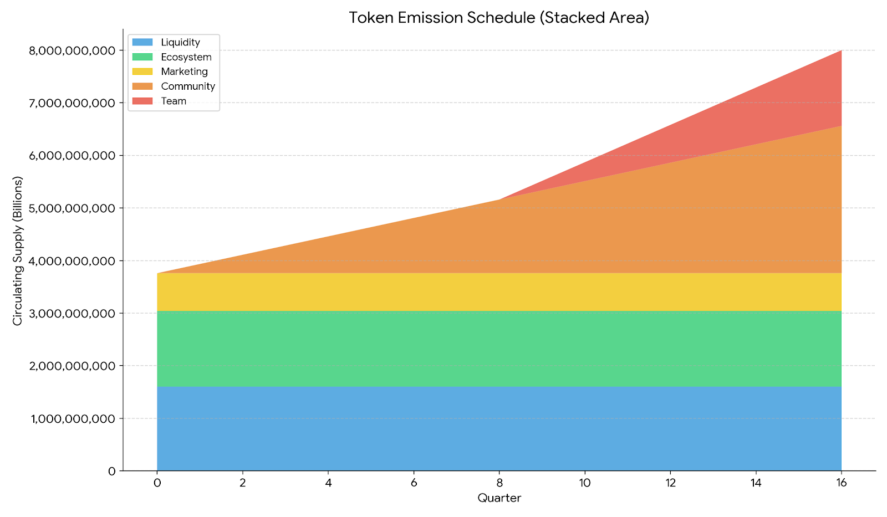

以下是 Gnos.ai 白皮书（v0.1.0）的完整**中文翻译版本**。翻译力求准确、专业，保留技术术语的英文原词并在首次出现时附上中文解释，结构和内容与英文版完全一致。

# Gnos.ai 白皮书 `v0.1.0`

## 摘要

Gnos.ai 是一个革命性的 AI 驱动音乐创作与社交平台，旨在民主化音乐生产、分发和变现。平台名称灵感来源于“song”（歌曲）倒写为“gnos”，象征对传统模式的颠覆性反思，并构建前瞻性生态。Gnos.ai 通过 AI 工具、区块链集成和社区治理赋能创作者、听众与开发者。用户可生成、上传并分享纯 AI 创作音乐，配以自定义封面图片和实时歌词字幕。平台采用双代币体系：治理代币 GNOS（总供应量 80 亿枚）和平台积分代币 CISUM（用于奖励与互动）。创作者通过广告、NFT 和授权等多种方式变现，平台则通过手续费和共享收入维持运营。平台全部收入的 20% 用于回购并销毁 GNOS，确保长期价值升值与生态可持续性。

本白皮书概述平台的愿景、架构、通证经济、收入模型及路线图，将 Gnos.ai 定位为 AI 驱动音乐创新的前沿。

## 引言

### 音乐行业的挑战
传统音乐行业面临进入壁垒高、中心化控制严重、收入分配不公等问题。新兴艺术家面临高昂制作成本、工具获取困难以及对唱片公司的依赖。流媒体平台占据主导，但分成微薄；AI 生成音乐尚未无缝融入社交与经济生态。知识产权管理碎片化，创作者难以有效保护和变现作品。

### Gnos.ai 的愿景
Gnos.ai 彻底颠覆传统模式——字面与象征意义上皆如此。“gnos”象征对过时模式的回望，以构建面向未来的去中心化、AI 中心化平台。我们设想一个世界：任何人均可利用 AI 创作专业级音乐，进行社交协作，并通过区块链赋能的 NFT 与代币奖励公平获利。Gnos.ai 将创意、社区与加密经济融合，赋能用户“边创作、边聆听、边分享边赚钱”。

### 核心功能
- **AI 音乐生成**：直观工具，通过 AI 算法作曲、混音、生成歌曲。
- **社交集成**：上传、分享、协作曲目，支持动态 feed、点赞、评论与播放列表。
- **NFT 铸造**：将歌曲转化为 ERC-721（唯一）或 ERC-1155（多版）NFT，实现所有权与交易。
- **变现渠道**：创作者通过广告、排行、授权等多种方式获利。
- **治理与奖励**：GNOS 用于投票与质押；CISUM 用于日常互动奖励。

## 产品架构

Gnos.ai 采用模块化、可扩展架构，融合 AI、区块链与云服务，确保流畅用户体验。核心组件如下：

### 3.1 前端用户界面
- **Web 与移动应用**：基于 React.js（Web）和 React Native（iOS/Android）的响应式设计，用户可访问创作、浏览与社交仪表盘。
- **音乐播放器**：嵌入式播放器，支持实时歌词字幕同步、高品质流媒体与高级用户离线下载。
- **封面艺术集成**：用户上传或 AI 生成封面图片，存储于 IPFS 实现去中心化。

### 3.2 AI 音乐创作工具
- **核心引擎**：采用高级 AI 模型（类似 MusicGen 或 Stable Audio），根据用户提示生成旋律、节奏、人声与歌词。
- **自定义编辑**：支持实时编辑输出、添加效果与多人协作。
- **输入/输出处理**：支持纯 AI 生成轨道上传或平台工具创作，所有上传内容均经 AI 来源验证。

### 3.3 后端服务
- **API 层**：RESTful 与 GraphQL 接口，用于认证、内容管理与实时更新（Node.js + Express）。
- **数据库**：PostgreSQL（结构化数据，如用户资料、歌曲元数据）+ MongoDB（非结构化，如评论、动态）。
- **AI 处理**：云端 GPU 集群按需生成音乐，集成 AWS SageMaker 或自定义 ML 管道。
- **社交功能**：基于用户互动的 feed 算法、AI 推荐协作与社区活动。

### 3.4 区块链集成
Gnos.ai 区块链层完全部署于 **FullOn Network**，这是一个专为 Web3 与 AI 生态设计的高性能 Layer-1 公链。通过独特的 2D 分片（2D-Sharding）与双链架构，实现近乎无限扩展，同时保持低延迟与高 TPS（目标超 100 万 TPS），完美匹配音乐实时生成、NFT 铸造、即时收益分发与高并发社交需求。

- **选择 FullOn Network 的原因**：
  - **高性能与低延迟**：多线程 + 多分片架构，确保歌曲上传、NFT 铸造、TBA（ERC-6551 标准）账户收益结算近乎瞬时，接近 Web2 体验。
  - **超低手续费**：Gas 费用极低（远低于以太坊主网及多数 L2），适合积分兑换、频繁听歌奖励、虚拟歌手养成等微交易。
  - **多链互操作性**：原生支持跨链桥接与互操作协议，用户可通过主流钱包（MetaMask、WalletConnect、HuFu Wallet 等）无缝交互。资产可桥接至以太坊、Solana 等生态，实现更广流动性。
  - **AI 友好**：专为 Web3 + AI 优化，支持高效链上 AI Agent 数据存储与计算，助力虚拟歌手 TBA NFT 长期养成与收益追踪。

- **NFT 市场**：通过 FullOn 智能合约实现 ERC-721（唯一歌曲/歌手）与 ERC-1155（限量版）铸造。音频、歌词、封面、AI 生成日志存储于 IPFS/Arweave，确保去中心化与永久性。
- **智能合约**：治理投票、收益自动分发（含 TBA 账户）、平台 20% 收入回购销毁 GNOS、AI 上传验证链上存证等全部部署于 FullOn。合约经第三方审计。
- **钱包集成**：全面支持 FullOn 原生钱包（例如 HuFu Wallet）与多链钱包（MetaMask、WalletConnect、RWID 手机号绑定账户）。一键切换网络与跨链资产导入/导出。

此部署大幅降低运营成本、用户进入门槛，并为未来跨链音乐版权市场等扩展预留空间。

### 3.5 安全与合规
- **数据隐私**：符合 GDPR，用户控制数据共享。
- **内容审核**：AI 辅助审查，防止版权侵权，确保所有内容为 AI 生成或已授权。
- **可扩展性**：Kubernetes 微服务架构 + CDN 全球内容分发。

### 3.6 用户流程
- **创作者流程**：注册 → 生成/上传歌曲 → 添加封面 & 歌词 → 可选铸造 NFT → 分享 & 变现。
- **听众流程**：浏览/聆听 → 赚取 CISUM → 邀请好友 → 交易 NFT。
- **开发者流程**：访问 API 用于二次创作（例如 remix 歌曲），伴随版税支付。

### 3.7 AI Agent 与虚拟歌手养成系统
Gnos.ai 引入高级 AI Agent 系统，允许用户个性化养成虚拟音乐歌手（Virtual Singers），拓展创作边界。该功能深度融合 AI 个性化与区块链技术，用户可“培养”专属 AI 歌手形象，并通过 Token Bound Account (TBA) NFT 链上管理所有权与收益权。

- **核心机制**：
  - **个性化养成**：通过 AI Agent 工具从零或模板开始，定义风格、声音特征、外观形象与背景故事。通过提示、样本上传与反馈迭代优化。
  - **社交互动**：虚拟歌手可发布动态、参与合唱、回复评论，实现沉浸式体验。
  - **TBA NFT 发行**：成熟虚拟歌手可铸造成 TBA NFT（ERC-6551 标准）。NFT 拥有独立链上钱包（Token Bound Account），用于持有与接收收益。
    - **NFT 类型**：ERC-721（唯一）或 ERC-1155（限量版）。
    - **铸造**：少量 GNOS 或 CISUM 费用；元数据含歌手资料、声音模型、歌曲历史与养成数据（IPFS 存储）。

- **收益机制**：
  - **收益归属**：虚拟歌手歌曲、表演或衍生内容收益（广告、Top 100 收费、授权）自动流入 TBA 账户。
  - **收益权转移**：NFT 交易后，新拥有者即时获得 TBA 控制权与未来收益权。
  - **分润**：平台保留 10-20% 手续费，其余（例如播放费 70%）直接入 TBA。用户随时可提取资金。

- **生态集成**：养成消耗 CISUM 或 GNOS；里程碑奖励额外 CISUM。TBA NFT 持有者获 DAO 投票加成。

此功能将 Gnos.ai 定位为 AI + Web3 音乐先锋，让用户从创作者进化为“虚拟偶像经理人”。

### 3.8 AI 音乐上传验证模块
为确保内容原创性与合法性，Gnos.ai 部署高级 AI 上传验证系统，对每首歌曲进行发布前/后扫描。

- **检测机制**：
  - AI 生成指纹分析（频谱、节奏、diffusion 痕迹），目标准确率 >98%。
  - 版权比对全球音频指纹库与第三方版权数据库。
  - 多模态校验：歌词原创性（NLP）、封面哈希、上传元数据。
  - 流程：上传即自动扫描；通过获“AI-Verified”徽章与 CISUM 奖励；未通过退回并提供建议。

- **生态益处**：保护知识产权、提升 NFT 价值、强化 Gnos.ai 作为纯净 AI 音乐平台的定位。

### 3.9 智能推荐与曲库管理系统
后端配备 AI 推荐引擎与标签自动分类系统，提升内容发现与用户留存。

- **推荐引擎**：
  - 基于听歌历史、标签、社交行为与 AI Agent 数据，使用协同过滤 + Transformer 模型推送个性化内容。
  - 结合“边听边赚”行为实时优化，与 Top 100 排行联动。

- **标签式自动曲库分类**：
  - AI 为每首歌生成 5-10 个标签（风格、情绪、元素、语言）。
  - 动态曲库支持搜索、过滤与聚合；标签增强 NFT 元数据与第三方分发。
  - 用户反馈循环持续提升准确率。

这些系统构成 Gnos.ai 智能核心，推动内容质量、粘性与商业化。

## 通证经济模型

### GNOS 治理代币
- **总供应量**：8,000,000,000 GNOS（ERC-20 兼容，部署于 FullOn Network 主网）。
- **分配**：
  - 社区奖励与空投：35% — 用于 Top 100 听歌奖励、邀请与 CISUM 转换。4 年线性释放，优先 FullOn 原生用户。
  - 团队与顾问：18% — 锁定 2 年，后按季度释放。
  - 流动性与交易所：20% — FullOn DEX 与跨链 LP 深度池。
  - 生态发展基金：18% — FullOn 专项资助（桥接、集成、AI 工具）。DAO 治理。
  - 营销与伙伴：9% — 利用 FullOn 多链互操作性。

- **效用**：
  - 治理：FullOn 上质押 GNOS 参与 DAO 投票（升级、手续费、跨链提案）。
  - 奖励：邀请与消费返利；多链迁移加成。
  - 回购销毁：平台 20% 收入自动在 FullOn 上回购并销毁 GNOS。

- **通胀/通缩**：无新增铸造；通过销毁实现通缩。跨链桥接激励（生态基金 2%）。

### 代币释放时间表
释放曲线设计促进长期一致性，逐步增加供应并通过销毁对冲。

| 季度 | 社区           | 团队           | 流动性         | 生态           | 营销           | 流通总量         |
|------|----------------|----------------|----------------|----------------|----------------|------------------|
| 0    | 0              | 0              | 1,600,000,000  | 1,440,000,000  | 720,000,000    | 3,760,000,000    |
| 1    | 175,000,000    | 0              | 1,600,000,000  | 1,440,000,000  | 720,000,000    | 3,935,000,000    |
| 2    | 350,000,000    | 0              | 1,600,000,000  | 1,440,000,000  | 720,000,000    | 4,110,000,000    |
| 3    | 525,000,000    | 0              | 1,600,000,000  | 1,440,000,000  | 720,000,000    | 4,285,000,000    |
| 4    | 700,000,000    | 0              | 1,600,000,000  | 1,440,000,000  | 720,000,000    | 4,460,000,000    |
| 5    | 875,000,000    | 0              | 1,600,000,000  | 1,440,000,000  | 720,000,000    | 4,635,000,000    |
| 6    | 1,050,000,000  | 0              | 1,600,000,000  | 1,440,000,000  | 720,000,000    | 4,810,000,000    |
| 7    | 1,225,000,000  | 0              | 1,600,000,000  | 1,440,000,000  | 720,000,000    | 4,985,000,000    |
| 8    | 1,400,000,000  | 0              | 1,600,000,000  | 1,440,000,000  | 720,000,000    | 5,160,000,000    |
| 9    | 1,575,000,000  | 180,000,000    | 1,600,000,000  | 1,440,000,000  | 720,000,000    | 5,515,000,000    |
| 10   | 1,750,000,000  | 360,000,000    | 1,600,000,000  | 1,440,000,000  | 720,000,000    | 5,870,000,000    |
| 11   | 1,925,000,000  | 540,000,000    | 1,600,000,000  | 1,440,000,000  | 720,000,000    | 6,225,000,000    |
| 12   | 2,100,000,000  | 720,000,000    | 1,600,000,000  | 1,440,000,000  | 720,000,000    | 6,580,000,000    |
| 13   | 2,275,000,000  | 900,000,000    | 1,600,000,000  | 1,440,000,000  | 720,000,000    | 6,935,000,000    |
| 14   | 2,450,000,000  | 1,080,000,000  | 1,600,000,000  | 1,440,000,000  | 720,000,000    | 7,290,000,000    |
| 15   | 2,625,000,000  | 1,260,000,000  | 1,600,000,000  | 1,440,000,000  | 720,000,000    | 7,645,000,000    |
| 16   | 2,800,000,000  | 1,440,000,000  | 1,600,000,000  | 1,440,000,000  | 720,000,000    | 8,000,000,000    |

  
图 1：GNOS 流通量时间表

### CISUM 积分系统
- **非可转让实用代币**：通过日常平台活动赚取。
- **赚取机制**：
  - 创作：上传验证 AI 歌曲获积分。
  - 聆听：“边听边赚” — 与播放时长成比例。
  - 社交：点赞、分享、评论等互动。
- **效用**：兑换高级 AI 工具、专属活动，或在里程碑时转换为 GNOS。
- **供应**：无上限但算法控制，定期销毁以维持平衡。

### 经济模型
双代币飞轮：CISUM 驱动日常互动与微交易；GNOS 提供长期治理与价值积累。GNOS 销毁带来的通缩压力支持可持续增长。

## 融资计划

为支持 FullOn Network 部署与生态扩展，Gnos.ai 采用分阶段融资，总目标 5000 万美元，结合 GNOS 代币与股权形式。

- **种子轮**：目标 1000 万美元（2026 Q4）。投资者获 5% GNOS 分配（生态基金划拨），锁定 1 年。资金用于 FullOn 主网上线、AI 验证与钱包集成。
- **A 轮**：目标 2000 万美元（2027 Q4）。投资者获 8% GNOS（2 年释放）。聚焦移动 App、跨链桥接与营销。
- **B 轮及后续**：目标 2000 万美元+（2028+）。剩余生态基金用于全球扩展、高级 TBA 功能与跨链伙伴合作。

- **机制**：
  - 早期投资者 GNOS 折扣 20-30%。
  - 资金分配：30% 用于 FullOn 基础设施，20% 跨链开发，其余运营与社区。
  - 投资者 GNOS 需至少质押 6 个月参与 DAO。
  - 合规：遵守全球法规（SEC/KYC）；FullOn 框架确保透明。投资存在风险。

## 收入模型

### 创作者收入
- 平台广告收入分成。
- NFT 二级销售版税（永久 5-10%）。
- Top 100 播放收费（70% 归创作者）。
- 第三方分发与曲库收录收入。
- 二次使用/授权费用。
- 其他（众筹、粉丝支持）。

### 平台收入
- 广告收入。
- NFT 铸造与交易手续费（2-5%）。
- 第三方上传佣金。
- Top 100 播放费分成（30%）。
- 二次使用费分成（20%）。
- 高级功能、API 访问、赞助。

平台全部收入 20% 用于 GNOS 回购销毁。

### 用户收入
- 通过聆听、策展与互动赚取 CISUM。
- 邀请奖励（GNOS 与 CISUM，RWID 手机号验证）。
- 平台内消费 GNOS 返利。
- 质押 GNOS 获得平台收入收益。

## 路线图

### 2026 Q1 – 2026 Q2  创世阶段
- 封闭内测与创作者邀请计划。
- 核心 AI 音乐生成工具 V1 上线。
- GNOS 代币与核心合约在 FullOn Network 部署 & 审计。
- ERC-721/1155 NFT 铸造与基础市场。
- RWID 手机号验证 + 邀请系统。
- 初始 CISUM 挖矿与“边听边赚”活动。
- 多链钱包集成。
- 种子轮融资与 FullOn 部署。

### 2026 Q3 – 2026 Q4  点火阶段
- 公开注册与移动 App（iOS & Android）上线。
- Top 100 付费预览机制（10 秒后收费）。
- 第三方平台分发准备。
- GNOS 治理 DAO 激活。
- 20% 收入自动回购 & 销毁实施。
- 首批品牌广告与赞助。
- 基础 AI Agent 养成工具（虚拟歌手 V1）。
- AI 上传验证 V1 与基础推荐引擎。
- A 轮融资用于跨链集成。

### 2027 Q1 – 2027 Q4  扩张阶段
- 高级 AI 工具：实时协作、人声克隆、情感控制。
- 二次创作与采样授权市场。
- 与主流 NFT 市场深度集成。
- GNOS 质押与流动性挖矿。
- 完整多链支持。
- 首届 Gnos Creator Awards。
- TBA NFT 上线：虚拟歌手铸造、收益绑定、交易。
- 高级 AI Agent 功能（3D 形象、社交模块）。
- FullOn 与以太坊/Solana 等深度跨链互操作。
- 增强标签曲库与个性化推荐。

### 2028 年及以后  生态成熟阶段
- 建立全球 AI 原生音乐创作标准。
- 推出 Gnos Protocol 开放集成协议。
- 实现 GNOS 可持续通缩模型。
- 链上音乐版权登记与全球收益自动分配。
- 演变为 AI 生成音乐创作与消费的基础设施。

**注**：路线图将根据市场反馈、技术进展、监管环境与社区治理动态调整。用户价值与创作者收益始终为核心决策依据。

## 风险与免责声明

- **市场风险**：加密货币波动性；GNOS 价值可能剧烈波动。
- **监管风险**：AI、NFT 与音乐权利相关法律法规演变。
- **技术风险**：AI 或区块链潜在漏洞；通过审计缓解。
- **无保证**：本白皮书仅供信息参考。投资存在风险，请咨询专业人士。

Gnos.ai 诚邀创作者、听众与创新者加入这场革命。访问 gnos.ai 或关注我们的更新获取更多信息。